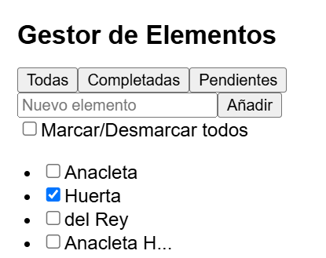
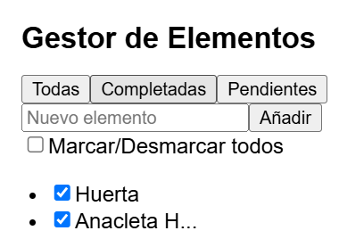
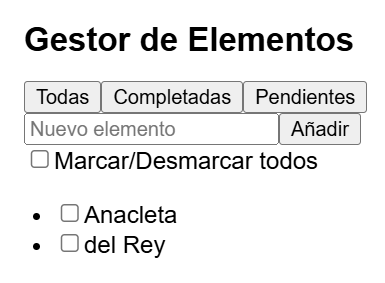

# Reentrega examen REACT. Abril.

Crea un gestor de Elementos

1. Componente principal: debe mantener en su estado un conjunto de objetos, cada uno con: 
   - id: identificador único.
   - texto: contenido del elemento.
   - completado: booleano que indica si el elemento está marcado.
2. Componente secundario: representa un solo objeto y debe:
   - Mostrar un checkbox para marcar o desmarcar su estado.
   - Mostrar el texto (si tiene más de 10 caracteres, debe recortarse y añadir ...).
3.  Entrada de usuario:
    - Añadir un campo de texto para crear nuevos elementos.
    - Al hacer clic en un botón, el nuevo elemento debe agregarse al conjunto.
4.  Control Global:
    - Agregar un checkbox general que marque o desmarque todos los elementos al mismo tiempo.

5.  Filtrado:
    - Permitir alternar entre ver:
      - Todos los elementos.
      - Solo los completados.
      - Solo los pendientes.

6. Estado inicial:
   - Deben aparecer en tres elementos distintos: tu nombre y tus dos apellidos.
   - Un cuarto elemento será tu nombre todo junto. 

